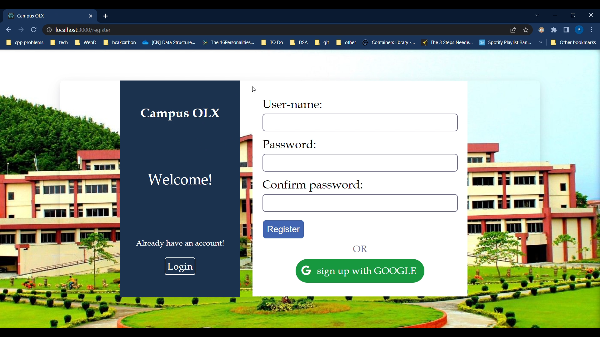
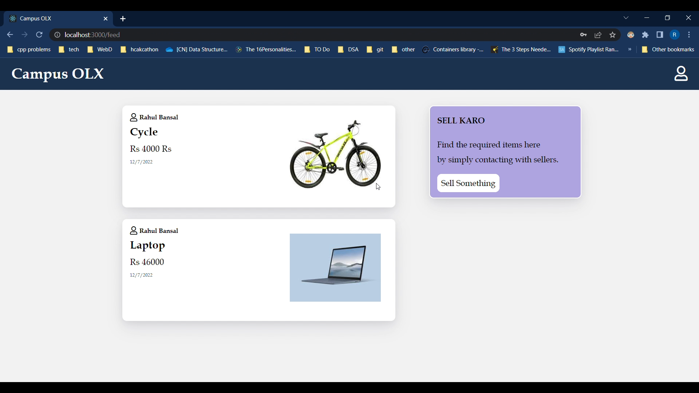
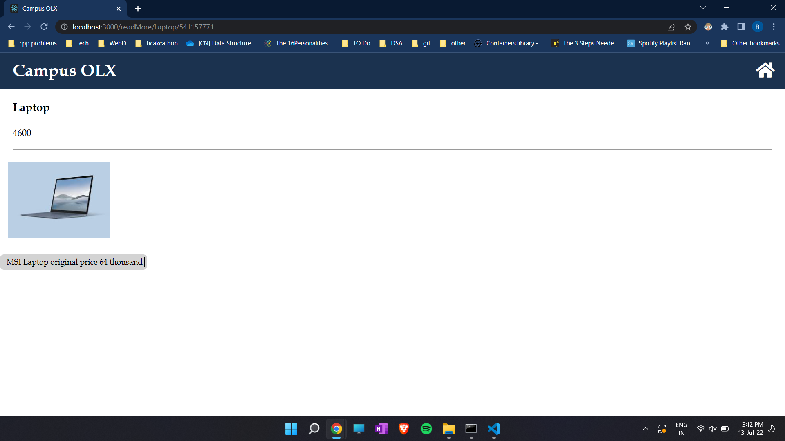
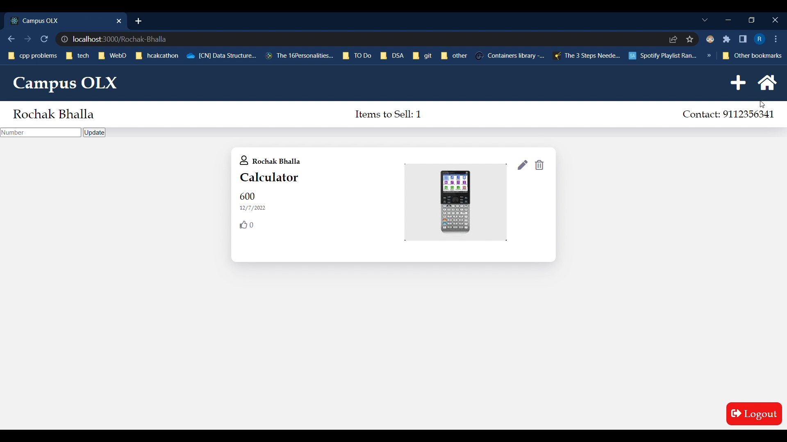

A Project under [Coding Club, IITG](https://www.iitg.ac.in/stud/gymkhana/technical/home/CodingHome.html)
# Campus-OLX
Campus Olx made for IIT Guwahati to buy and sell within the campus

### About :
A platform for all the residents of iitg to buy and sell stuff within the campus

## Features:

- View all the items listed to sell by different people
- Display and view User Profile containing all relevant conntact info
- Add any new item to sell after login
- Delete the items sold or update the price/ description of the selling items

### Contributers:
- [Aman Soni](https://github.com/ssamansoni "Aman Soni")
- [Aditya Patidar](https://github.com/Adii45 "Aditya Patidar")
- [Kartik Masaliya](https://github.com/kartikmalasiya "Kartik Malasiya")
- [Piyush Gulve](https://github.com/Piyush-6 "Piyush Gulve")
- [Prakash Raj](https://github.com/Prakash6429 "Prakash Raj")
- [Rahul Bansal](https://github.com/b369rahul "Rahul Bansal")
